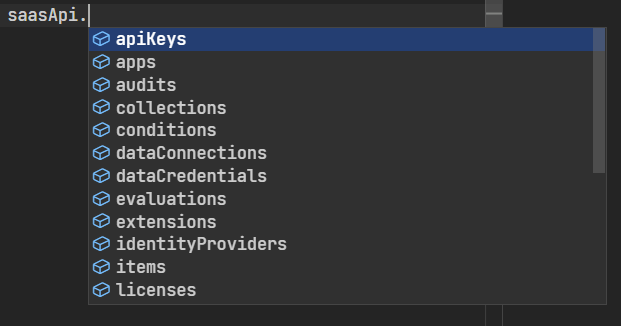
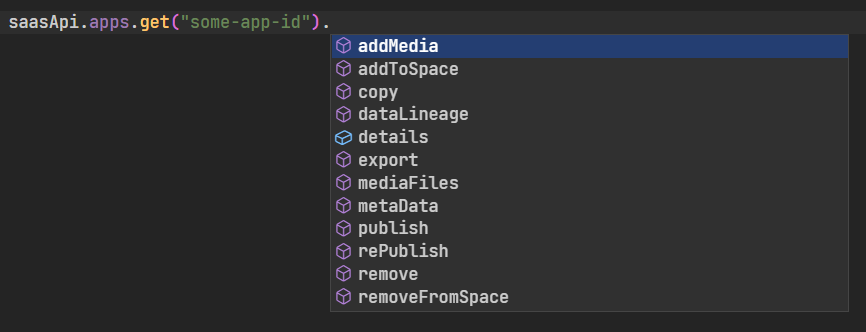
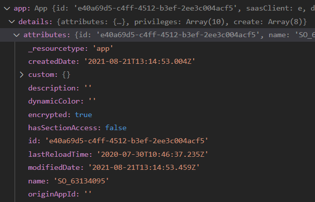

## UNDER DEVELOPMENT

**NOT AFFILIATED WITH QLIK**

---

# Qlik Sense SaaS REST API

Node.js module to interact with Qlik Sense SaaS API

## Installation

`npm install qlik-saas-api`

## Authentication

At this moment only JWT authentication is supported

## Usage

Initialize the client

```javascript
import { QlikSaaSApi } from "qlik-saas-api";

const saasApi = new QlikSaaSApi.client({
  host: "tenant-url",
  authentication: {
    token: "eyJhbGciOiJSUzI1NiIsInR5cCI6IkpXVCJ9...",
  },
});
```

List of available methods:


List of apps methods:


Details for an app:


## Methods

Full list of available methods can be found [here](https://informatiqal.github.io/qlik-saas-api/modules.html)
